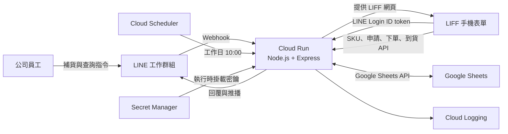
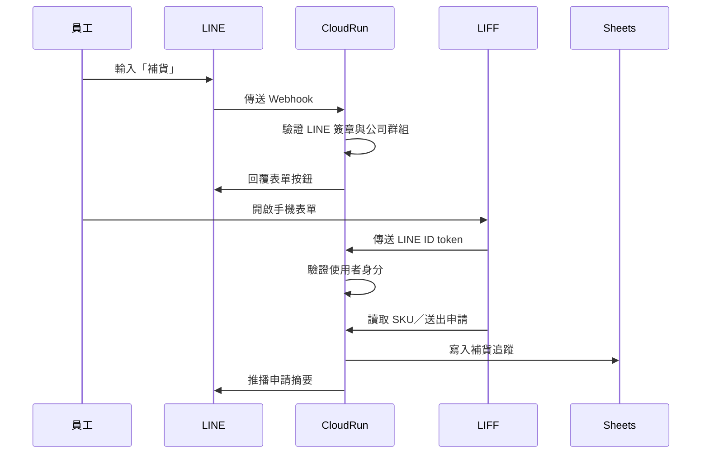

# LINE Company Procurement System

以 LINE 工作群組作為入口、LIFF 作為手機表單、Google Sheets 作為資料後台、Google Cloud Run 作為應用伺服器的公司內部補貨管理系統。

系統解決以下問題：

- 員工提出補貨需求後，不確定老闆是否已經下單。
- 多人可能對相同商品重複提出補貨。
- 商品部分到貨時，難以確認已到與未到數量。
- 權限、下單、到貨及操作人缺乏一致紀錄。
- 大量 SKU 不適合直接在 LINE 聊天室逐項輸入。

## 核心概念

| 元件 | 在系統中的角色 |
| --- | --- |
| LINE Official Account／Messaging API | 員工入口、群組指令、回覆與主動通知 |
| LINE Login | 確認目前操作表單的人員身分 |
| LIFF | 在 LINE 裡開啟的手機版商品與補貨表單 |
| Cloud Run | 執行程式、API、Webhook、權限與補貨流程的系統大腦 |
| Google Sheets | SKU、補貨單、權限、設定與操作紀錄的資料後台 |
| Cloud Scheduler | 工作日上午自動觸發未處理及逾期提醒 |
| Secret Manager | 保存 LINE 密鑰與系統簽章金鑰 |
| Cloud Logging | 保存 Cloud Run 執行與錯誤日誌 |

## 系統架構



這是一個小型單體式應用程式：前端網頁、API、Webhook 與排程入口部署在同一個 Cloud Run Service 中。元件少、維護成本低，適合目前公司內部使用規模。

## 主要功能

### 補貨申請

1. 員工在指定 LINE 工作群組輸入 `補貨`。
2. Bot 驗證 Webhook 簽章與工作群組後，回覆 LIFF 表單入口。
3. 員工使用商品名稱、SKU 或規格文字搜尋商品。
4. 同一張申請可加入多個 SKU、數量及備註。
5. 系統檢查相同 SKU 是否已有未結案紀錄。
6. 申請寫入 Google Sheets，Bot 在群組推播摘要。

### 下單與到貨

- `採購確認` 或 `管理員` 可確認下單量與預計到貨日。
- `到貨確認` 或 `管理員` 可登記本次實到數量。
- 支援部分到貨、累計到貨及全部完成。
- 下單、到貨與取消皆記錄操作人及時間。

### LINE 群組指令

```text
補貨
補貨指令
查未結案
查待確認
查已下單
查部分到貨
查已完成
查取消

授權 @成員 申請人
授權 @成員 採購確認
授權 @成員 到貨確認
授權 @成員 管理員
停用 @成員
查權限 @成員
```

授權指令只有已啟用的管理員能使用。系統使用 LINE Webhook 提供的 user ID 識別成員，不依賴可能重複或變更的顯示名稱。

### 自動提醒

Cloud Scheduler 於 `Asia/Taipei` 時區的週一至週五上午 10:00 呼叫提醒端點：

- 補貨申請超過 24 小時仍待確認。
- 已超過預計到貨日，但仍有未到數量。
- 同一案件同一天不重複提醒。

## 一次補貨的資料流程



## Google Sheets 資料分工

| 分頁 | 用途 |
| --- | --- |
| `SKU主檔` | SKU、商品名稱、規格、搜尋字、是否可補貨 |
| `商品圖片對照` | 商品圖片與規格圖片網址 |
| `補貨追蹤` | 申請量、下單量、到貨量、狀態、操作人 |
| `授權人員` | LINE user ID、顯示名稱、角色、啟用狀態 |
| `操作紀錄` | 申請、下單、到貨及授權稽核 |
| `系統設定` | 工作群組 ID 等非機密設定 |

Google Sheets 由 Cloud Run 專用服務帳號存取。LINE Channel Secret、Access Token 等機密不得存放在試算表。

## 專案結構

```text
public/                  LIFF 手機版前端
  index.html
  app.js
  catalog.js
  styles.css

src/
  server.js              程式啟動點
  app.js                 Express 應用程式與錯誤處理
  config.js              環境變數驗證
  routes/
    webhook.js           LINE Webhook 與群組指令
    api.js               SKU、申請、下單、到貨 API
    jobs.js              Scheduler 提醒入口
  services/
    requests.js          補貨申請規則
    workflow.js          下單、到貨與角色規則
    reminders.js         提醒規則
    group-commands.js    查詢與授權指令
  line/
    identity.js          LINE Login 身分驗證
    messenger.js         LINE 回覆與推播
    context.js           群組連結簽章
  sheets/
    repository.js        Google Sheets 資料存取

test/                    Node.js 自動測試
scripts/                 建置、密鑰及 Google Cloud 部署腳本
docs/                    功能規格、設計與部署文件
Dockerfile               Cloud Run 容器定義
```

## 技術堆疊

- Node.js 22+
- Express 5
- `@line/bot-sdk`
- Google APIs Node.js Client
- 原生 HTML、CSS、JavaScript
- LIFF SDK
- Google Cloud Run
- Google Cloud Scheduler
- Google Secret Manager
- Google Sheets API
- Node.js `node:test`

## 本機開發

```powershell
npm.cmd install
npm.cmd run dev
```

必要環境變數請參考 `.env.example`。正式密鑰不可提交至 Git。

## 驗證

```powershell
npm.cmd test
npm.cmd run lint
npm.cmd run build
```

目前自動測試涵蓋：

- LINE Webhook 簽章與群組限制
- LINE Login ID token 驗證
- SKU 搜尋與商品卡片
- 多品項補貨申請
- 重複申請與冪等防護
- 下單、部分到貨及完成狀態
- 角色與群組授權指令
- Scheduler 提醒與重複提醒防護
- Google Sheets 寫入範圍
- 手機版商品及規格畫面

## 部署

正式環境使用 Cloud Run Source Deployment。部署腳本會：

1. 啟用必要的 Google Cloud APIs。
2. 檢查 Cloud Run 服務帳號。
3. 掛載 Secret Manager 中的密鑰。
4. 建立新的 Cloud Run revision。
5. 更新 Cloud Scheduler 提醒工作。

```powershell
.\scripts\deploy-gcp.ps1 `
  -ProjectId '<PROJECT_ID>' `
  -LineLoginChannelId '<LINE_LOGIN_CHANNEL_ID>' `
  -LiffId '<LIFF_ID>'
```

詳細步驟請參考 `docs/deployment.md`。

## 安全設計

- LINE Webhook 使用原始 request body 驗證 `x-line-signature`。
- LIFF ID token 必須由 Cloud Run 伺服器驗證。
- 工作群組連結帶有簽章與有效期限。
- 寫入操作使用 idempotency key，避免雙擊或重送造成重複資料。
- 只有指定公司群組可以操作，其他群組不能覆寫設定。
- 管理員不能停用自己或移除自己的管理員權限。
- Scheduler 端點使用獨立 Bearer token。
- 正式密鑰保存在 Secret Manager，不寫入 Git、Sheets 或日誌。

## 目前限制與維護重點

1. `補貨追蹤`目前程式處理上限為 5,000 列，接近 4,000 列時應規劃封存或資料庫遷移。
2. Google Sheets 適合目前規模，但不是高併發交易資料庫。
3. Cloud Run 目前最多一個執行個體，搭配程式內寫入佇列降低 Sheet 競爭寫入。
4. 沒有最低執行個體時，久未使用後第一次請求可能有冷啟動延遲。
5. 正式環境尚未拆分獨立 staging LINE Channel、Sheet 與 Cloud Run Service。
6. 建議建立 Sheet 定期備份、Cloud Run 錯誤警報、Scheduler 失敗警報與權限定期複查。

## 建議後續方向

- 建立 staging 測試環境。
- 建立 Google Sheets 自動備份與歷史封存。
- 增加 Cloud Monitoring 告警。
- 建立 LINE Token 輪替與離職停權流程。
- 資料量或同時操作人數增加時，評估遷移至 Cloud SQL 或 Firestore。
- 若庫存系統未來提供 API，可把即時庫存與商品資料同步接入目前的 repository/service 架構。

## 相關文件

- `docs/replenishment-line-mvp-spec.md`：第一版完整規格
- `docs/line-group-commands-spec.md`：群組查詢與授權指令規格
- `docs/product-card-liff-spec.md`：商品卡片式 LIFF 設計
- `docs/product-image-mapping-spec.md`：商品圖片資料規格
- `docs/deployment.md`：Google Cloud 與 LINE 部署手冊

此專案為公司內部使用系統。請勿將正式密鑰、LINE user ID、群組 ID 或客戶資料提交至版本庫。
